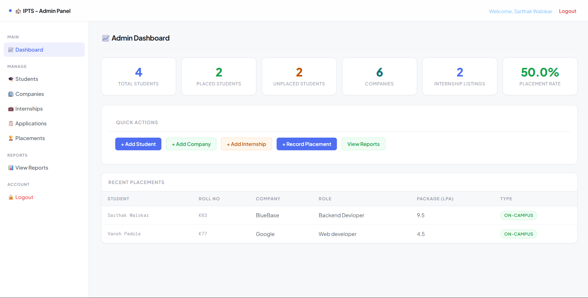

# Internship Placement Tracking System

## Description

This project is designed to manage and track student internship and placement records efficiently. It provides a structured system for both students and administrators.

---

## Features

* Student Login and Registration
* Admin Dashboard
* Add and Update Internship Details
* Placement Tracking
* View Reports

---

## Technologies Used

* Java (Servlets and JSP)
* JDBC
* MySQL
* HTML, CSS

---

## Screenshots

### Login Page

  

### Dashboard

  

### Add Internship

  

### Placement

  

---

## How to Run

1. Clone the repository
2. Import the project into Eclipse
3. Configure the MySQL database
4. Run the project using Apache Tomcat
5. Open in browser

---

## Database

* Student Table
* Internship Table
* Placement Table

---

## Future Scope

* Email Notifications
* Company Portal Integration

---

## Author

Sarthak Walokar
